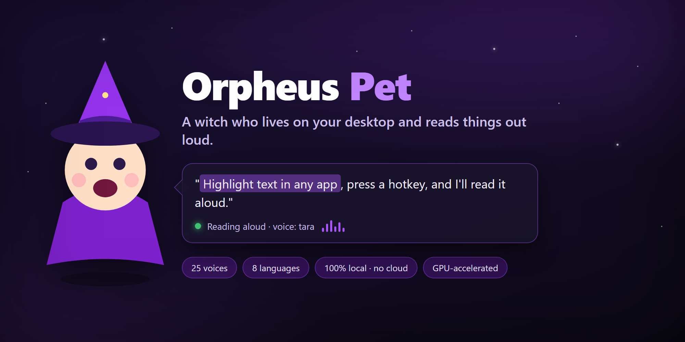

# Orpheus Pet 🧙‍♀️

<p align="center">
  
</p>

A little **witch who lives on your desktop and reads things out loud.** She floats
on top of everything (transparent, always-on-top), lip-syncs while she talks, and
sulks with duct tape over her mouth when you pause her. Under the pointy hat is a
fully local, GPU-accelerated **[Orpheus](https://github.com/Lex-au/Orpheus-FastAPI)
text-to-speech** stack — no cloud, no API keys, nothing leaves your machine.

Highlight text in *any* app, hit a hotkey, and she reads it. 25 voices, 8 languages.

> **One program.** You launch the pet; she quietly conjures her own backend
> (llama-server + Orpheus-FastAPI) as hidden child processes and tears them down
> when she leaves. No terminals to babysit.

---

## ✨ Quick start

**You'll need** (Windows 10/11):

| Thing | Why | Get it |
|---|---|---|
| [Node](https://nodejs.org) + [pnpm](https://pnpm.io) | builds the pet's UI | `npm i -g pnpm` |
| [Rust](https://rustup.rs) + MSVC Build Tools | Tauri's shell | rustup + "Desktop development with C++" |
| [Python 3.10/3.11](https://python.org) | the TTS server | — |
| `llama-server` | runs the model on your GPU | a [llama.cpp release](https://github.com/ggml-org/llama.cpp/releases) |
| An NVIDIA GPU | fast speech (CPU works too, slower) | — |

**Then:**

```powershell
git clone https://github.com/ManuelRueedi/orpheus-pet.git OrpheusTTS
cd OrpheusTTS

# One-shot setup: Python venv + backend deps, llama-server, config, pnpm install.
# No NVIDIA GPU? add  -Cpu . Providing your own llama-server? add  -SkipLlama .
.\setup.ps1

# Run her:
cd orpheus-pet
pnpm tauri dev
```

<details>
<summary><b>What <code>setup.ps1</code> does — or set it up by hand</b></summary>

The script is just the manual steps in one place; run them yourself if you prefer:

```powershell
# 1. TTS backend (Python) — PyTorch is installed separately (CUDA wheel)
cd Orpheus-FastAPI
python -m venv venv
venv\Scripts\python -m pip install torch --index-url https://download.pytorch.org/whl/cu124
venv\Scripts\pip install -r requirements.txt
cd ..

# 2. llama-server — unzip a llama.cpp release (CUDA build) so you have:
#    llama\llama-server.exe   (+ its .dll files, and the matching cudart DLLs)

# 3. The pet
cd orpheus-pet
pnpm install
pnpm tauri dev
```

**Config is automatic:** on first launch the pet writes `orpheus-pet\stack.config.json`
from the bundled default if it's missing, so there's no copy step. Edit that file
afterwards to tune `quant` / `llamaArgs` for your GPU (see *Lower-spec machines* below).
</details>

**First run:** right-click the witch → pick your language → she downloads that
voice model (~1.5–3.8 GB, with a bubbling cauldron progress bar 🫧) and starts
talking. That's it.

To ship a real app: `pnpm tauri build` → an installer/exe lands in
`orpheus-pet/src-tauri/target/release/`. Launch that once and she'll **auto-start
at login** from then on.

---

## 🖱️ Using her

- **Drag** her anywhere.
- **Left-click** (when idle) → she says a random line, so you can hear the voice.
- **Right-click** → the controls panel: type something + **Speak**, switch
  **voice**/**language**, or rebind the hotkey. The panel floats to whichever
  side has room and follows her around.
- **Left-click while she's talking** → pause (duct tape goes *slap*). Click again
  to rip it off and resume.
- **Global hotkey** (default **Ctrl+Alt+A**) → highlight text in *any* app and she
  pops up and reads it. Rebind it in the panel.

---

## 🐢 Lower-spec machines — swap the model

Short on VRAM? The default `Q8_0` model is the nicest-sounding but the chunkiest.

**Easiest — the model-size dropdown.** Right-click the witch and use the size
picker in the panel (bottom, next to the hotkey): **Best quality** → **Balanced**
→ **Low-spec**. It's a *download preference*: pick a size and the language list
updates to show it — the next language you download comes at that size (with the
cauldron progress bar). If you already have the current language at that size,
she hot-swaps to it instantly. It never re-downloads your current voice on its
own, so you can set size and language independently. No restart, no file editing;
your pick sticks across restarts.

| Pick | Quant | Rough size | Rough VRAM |
|---|---|---|---|
| Best quality | `Q8_0` | ~3.5 GB | 5–6 GB |
| Balanced | `Q4_K_M` | ~2.4 GB | ~3 GB |
| Low-spec | `Q2_K` | ~1.6 GB | ~2 GB |

English has all three; other languages quietly fall back to `Q8_0` if a smaller
one isn't published. Only one model is ever loaded at a time.

**For the last drop of speed (or CPU-only),** hand-tune
**`orpheus-pet/stack.config.json`** — the dropdown sets `quant`; this is how you
reach the GPU-layers knob:

```jsonc
{
  "quant": "Q4_K_M",              // same values as the dropdown
  "llamaArgs": ["-ngl", "20", "-c", "4096"]
}
```

- **`-ngl`** — how many model layers ride on the GPU. `99` = all of it (needs the
  most VRAM). Lower it (say `20`) to share the load with your CPU, or set `0` for
  **CPU-only** — slow, but it runs on anything.

---

## 🗣️ Languages

Each language is its own fine-tuned model (English, French, German, Spanish,
Italian, Korean, Hindi, Chinese). Pick one in the panel; if it isn't downloaded
yet she'll ask before fetching it, then hot-swap without a restart. Spanish and
Italian share a model (instant switch). Your choice sticks across restarts.

---

## 🧠 How it's built

```
you ── launch ──▶  orpheus-pet  (Tauri v2 + Rive + Web Audio)   ← the witch
                        │  spawns & owns, as hidden children:
                        ├─▶ llama-server.exe        GGUF inference on the GPU  (:1234)
                        └─▶ Orpheus-FastAPI (uvicorn) tokens → WAV via SNAC     (:5005)
```

The orchestration lives in [`orpheus-pet/src-tauri/src/stack.rs`](orpheus-pet/src-tauri/src/stack.rs);
the pet's own docs (interactions, art pipeline, file map) are in
[`orpheus-pet/README.md`](orpheus-pet/README.md). **Hacking on it with an AI
agent?** Point it at [`AGENTS.md`](AGENTS.md) first.

Want to replace the placeholder SVG witch with real animated art? That whole
Tripo → Rive pipeline is in [`orpheus-pet/ART-GUIDE.md`](orpheus-pet/ART-GUIDE.md) —
drop a rig at `orpheus-pet/public/pets/witch.riv` and she wears it automatically.

---

## 📜 Credits & license

- **Speech engine:** [Orpheus-FastAPI](https://github.com/Lex-au/Orpheus-FastAPI)
  by Lex-au (Apache-2.0), vendored in [`Orpheus-FastAPI/`](Orpheus-FastAPI/) with a
  streaming endpoint added. Its own `LICENSE` is kept intact.
- **Models:** [lex-au](https://huggingface.co/lex-au) Orpheus-3b GGUF fine-tunes.
- **Inference:** [llama.cpp](https://github.com/ggml-org/llama.cpp).
- **Shell & animation:** [Tauri](https://tauri.app) + [Rive](https://rive.app).

This project's own code is **MIT** (see [`LICENSE`](LICENSE)) — swap in your name,
or a different license, as you like. The bundled `Orpheus-FastAPI/` stays Apache-2.0.
Voice models carry their own licenses on HuggingFace.
